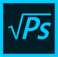

#  Developer Guide for Photoshop-Ultra-Light
*hello, developer!*

## About the Project

    Language: Java 1.8 or Java 8

    Build tool: Maven 3.1.5 & Gradle

    APIs: OpenCV

## About Java JDK
If your system does not have Java JDK installed already, you have to install it first. Please note that Java open jdk version `java-1.8.0-openjdk` is not compatible, because `javafx` library is missing. Before you start, make sure your JDK version is correct. 

**JDK Installation**
1. If your system already has Java installed, you can skip this step.
2. Otherwise, install [Java SE Development Kit 8](https://www.oracle.com/technetwork/java/javase/downloads/jdk8-downloads-2133151.html)  
Choose from the list and download the compatible version to your OS system.
 
**Check Java JDK version**
1. **Windows User:** 
   * Open command prompt and type `java -version`, then check the Java version.
   * If you need to switch JDK, go to `start menu-->System-->Advanced-->Environment Variables`. 
     Check if both PATH and JAVA_HOME has the `$path_to_your_jdk`. 
   * **Path of your Java JDK:** Normally all your Java JDKs live in `C:\Program Files\Java` unless you speicified a different path
     while installation. The `$path_to_your_jdk` is `C:\Program Files\Java\$your_jdk_folder_name`
   
   
2. **Mac OS/ Linux:**
   * `echo $JAVA_HOME` in your terminal, and it will show which Java JDK is used for your current system.
   * If you need to switch JDK, do `$JAVA_HOME=$path_to_your_jdk`. 
   * **Path of your Java JDK**: Normally all your Java JDKs live in `/usr/lib/jvm`, and thus simply `ls /usr/lib/jvm`,
     and you shall see different JDK folders (if you have multiple version installed). Then, `/usr/lib/jvm/$your_jdk_folder_name`
     is the `$path_to_your_jdk`

## Get Started

1. Get your Java environment ready, download [here](https://java.com/en/download/help/download_options.xml)
2. Make sure maven is installed [Maven](https://maven.apache.org/install.html)
3. Make sure Gradle is installed [Gradle](https://gradle.org/install)

Note: If you're using older Java version, you might want to make sure you have 
[JavaFX](https://docs.oracle.com/javase/8/javafx/get-started-tutorial/jfx-overview.htm) included

## How to Build and Run the Application

**Option 1 (Recommended)**
1. Install or open [IntelliJ IDEA](https://www.jetbrains.com/idea/download/)
2. Select `Project from Version Control`
3. Select `Git`
4. Paste `https://github.com/yashdhume/Photoshop-Ultra-Light.git` in the URL field
5. If not logged in yet, log in to Github account first (bottom left hand side)
6. Select `clone` and the repository should be clone to the workspace
7. Run the project

**Option 2**

1. Clone the repository: `git clone https://github.com/yashdhume/Photoshop-Ultra-Light.git`
2. Install or open [Eclipse](https://www.eclipse.org/downloads/)
3. Import project to Eclipse
4. Make sure Maven module are included
5. Build and run the application

**Option 3**

1. Clone the repository: `git clone https://github.com/yashdhume/Photoshop-Ultra-Light.git`
2. Go into the directory: `cd Photoshop-Ultra-Light`
3. Build using Maven: `mvn clean install`
4. Depends on your OS system:
   1. If running on MacOS `click gradlew`
   2. If running on Windows `click gradlew.bat`
5. Build using Gradle `gradle build`
6. Run the Application `gradle run`

## So, What are the Codes doing?

Let's see [here](./CODE_GUIDE.md) in detail where to find its functionality and how it's being implemented

## What's Next?

Now, everything is compiled and running...

Let's [learn more](./USER_GUIDE.md) how to use the application!
