#  User Guide for Photoshop-Ultra-Light
*hello, user!*

## Install the Application

## Get Started

1. Open or Run the Application

2. On the menubar select `File` and then `New`

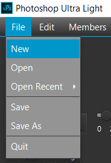

3. After you selected New, the application will prompt you to decide your workspace size

4. **Open image from your machine**: select`File` then `Open` then select desired image
   
   **Using webcam**: On the right hand side, select the `Camera` icon to take picture using your webcam
   
   **Google Search**: On the right hand side, click on `Google` icon and do your search
    
    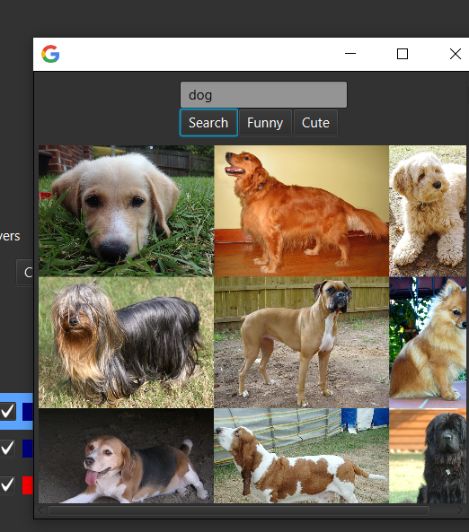
    
    Note: If you're `using webcam or Google search` drag the picture to the workspace
    
    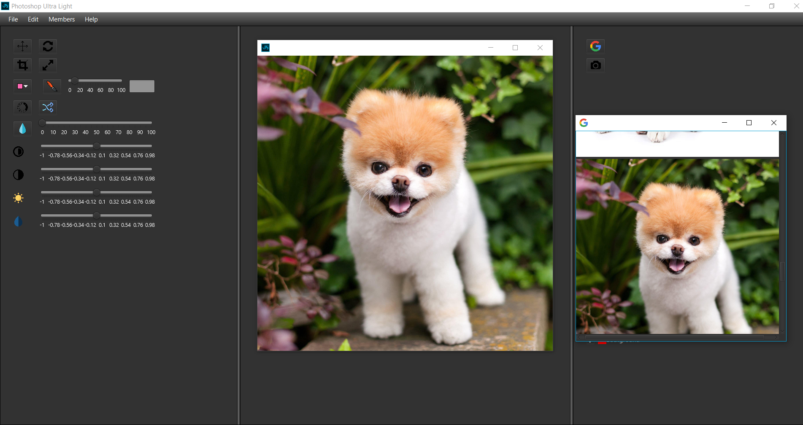
    
5. Now, you're all set!
   
   Make sure you're `selecting the latest layer on the layer section` and 
   now you can edit the picture using our available tools and you can always save it after
   
   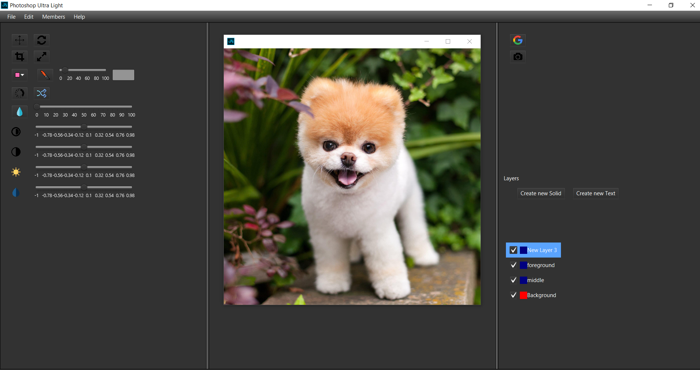
   

## More About the Tools

### Basic Tools

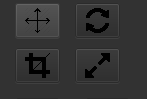

Move, Rotate, Crop, and Resize

## Original Picture (for Comparison)

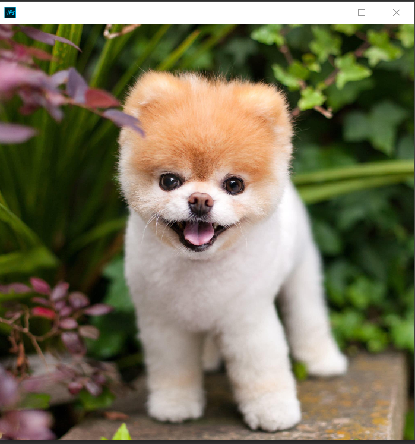

### Brush

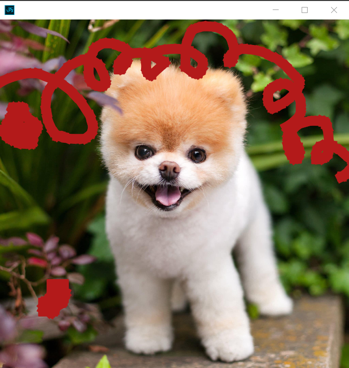

## Text

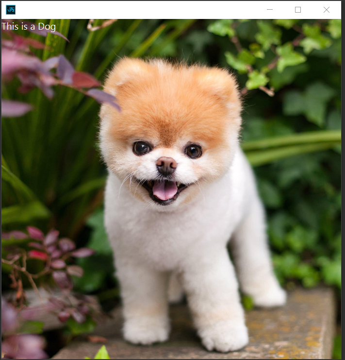

### Filters

**Black and White**

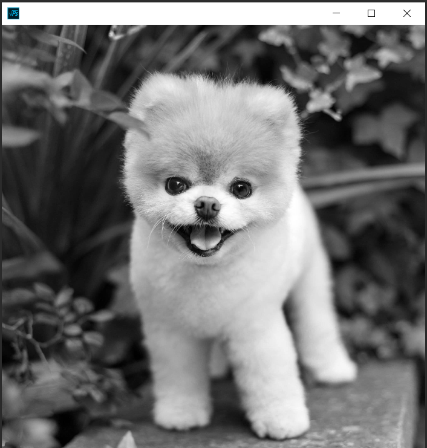

**Gaussian Blur**

### Hue, Saturation, Contract, Brightness

**Hue**

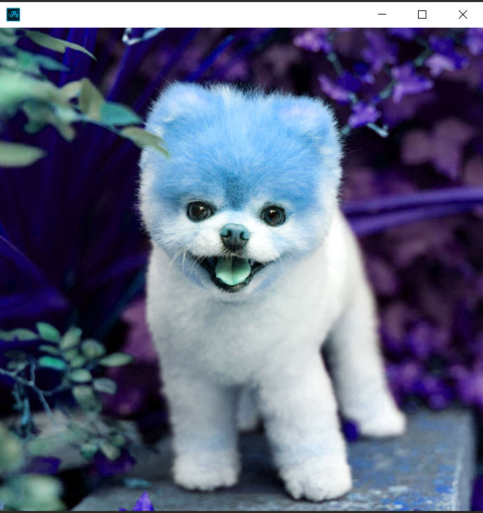

**Saturation**

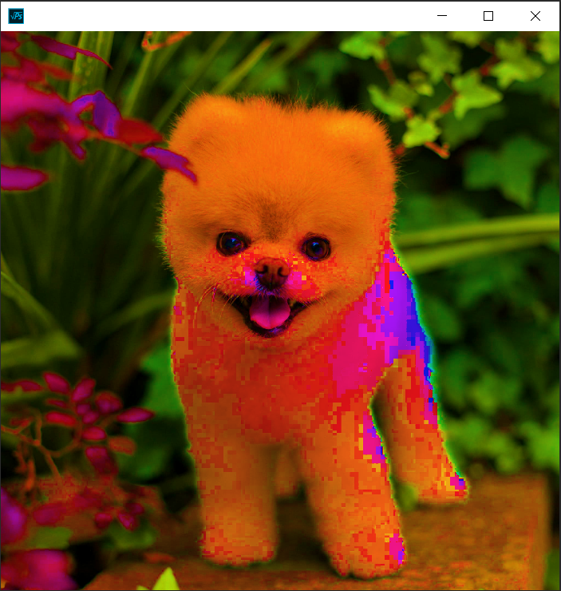

**Brightness**

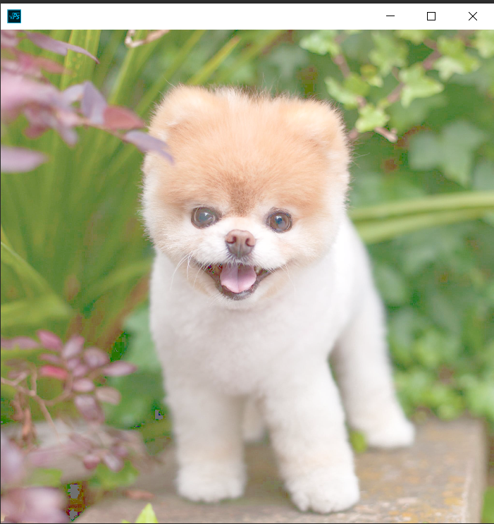

**Contrast**

